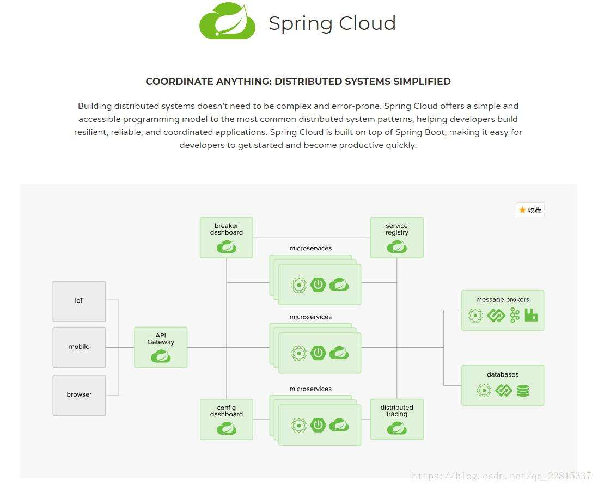
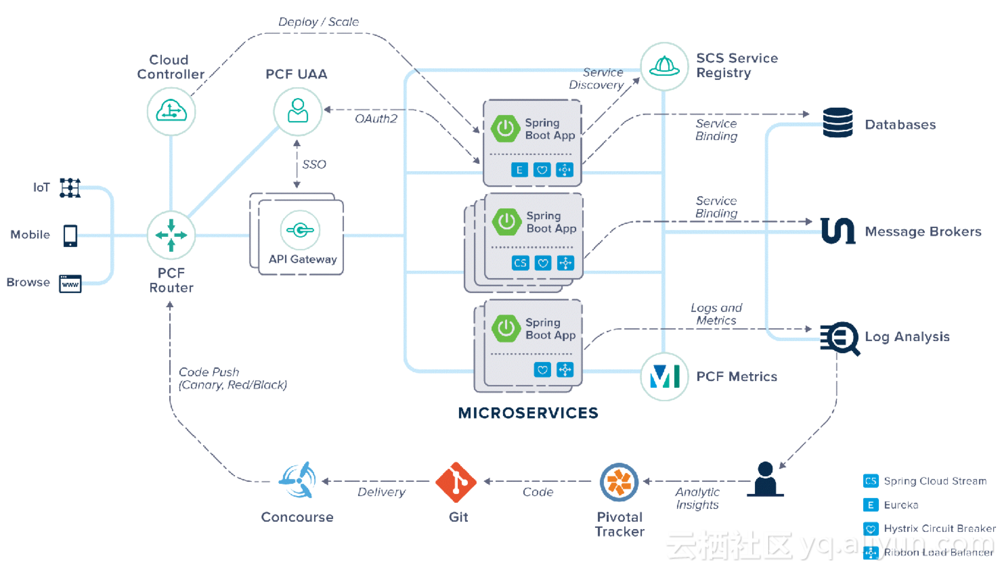
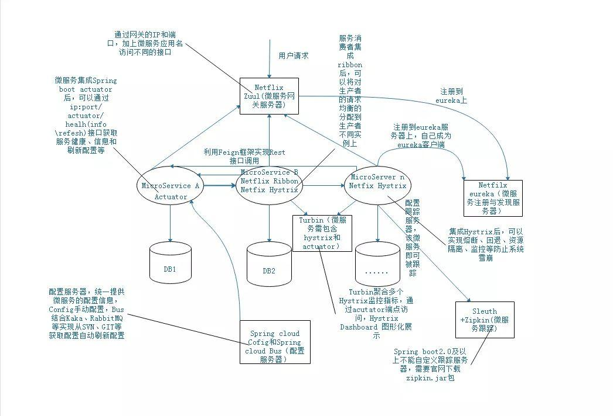

# 01 Quick Start

## 1、项目简介

### （1）概念

微服务是SOA架构下的最终产物，该架构的设计目标是为了肢解业务，使得服务能够独立运行。

微服务设计原则：1、各司其职 2、服务高可用和可扩展性

（）

## 2、参考文档

项目地址：https://spring.io/projects/spring-cloud

## 3、SpringCloud 架构及核心组件

由上图所示微服务架构大致由上图的逻辑结构组成，其包括各种微服务、注册发现、服务网关、熔断器、统一配置、跟踪服务等。下面说说Spring cloud中的组件分别充当其中的什么角色。

###	Feign

Feign(接口调用)：微服务之间通过Rest接口通讯，Spring Cloud提供Feign框架来支持Rest的调用，Feign使得不同进程的Rest接口调用得以用优雅的方式进行，这种优雅表现得就像同一个进程调用一样。

### Eureka

Netflix eureka(注册发现)：微服务模式下，一个大的Web应用通常都被拆分为很多比较小的web应用(服务)，这个时候就需要有一个地方保存这些服务的相关信息，才能让各个小的应用彼此知道对方，这个时候就需要在注册中心进行注册。每个应用启动时向配置的注册中心注册自己的信息（ip地址，端口号, 服务名称等信息），注册中心将他们保存起来，服务间相互调用的时候，通过服务名称就可以到注册中心找到对应的服务信息，从而进行通讯。注册与发现服务为微服务之间的调用带来了方便，解决了硬编码的问题。服务间只通过对方的服务id，而无需知道其ip和端口即可以获取对方方服务。

### Ribbon

**Ribbon(负载均衡)：**Ribbon是Netflix发布的负载均衡器，它有助于控制HTTP和TCP客户端的行为。为Ribbon，配置服务提供者的地址列表后，Ribbon就可基于某种负载均衡算法，自动地帮助服务消费者去请求。Ribbon默认为我们提供了很多的负载均衡算法，例如轮询、随机等。当然，我们也可为Ribbon实现自定义的负载均衡算法。在SpringCloud中，当Ribbon与Eureka配合使用时，Ribbon可自动从EurekaServer获取服务提供者的地址列表，并基于负载均衡算法，请求其中一个服务提供者的实例（为了服务的可靠性，一个微服务可能部署多个实例）。

### Hystrix

**Hystrix(熔断器)：**当服务提供者响应非常缓慢，那么消费者对提供者的请求就会被强制等待，直到提供者响应或超时。在高负载场景下，如果不做任何处理，此类问题可能会导致服务消费者的资源耗竭甚至整个系统的崩溃（雪崩效应）。Hystrix正是为了防止此类问题发生。Hystrix是由Netflix开源的一个延迟和容错库，用于隔离访问远程系统、服务或者第三方库，防止级联失败，从而提升系统的可用性与容错性。Hystrix主要通过以下几点实现延迟和容错。

包裹请求：使用HystrixCommand（或HystrixObservableCommand）包裹对依赖的调用逻辑，每个命令在独立线程中执行。这使用了设计模式中的“命令模式”。

跳闸机制：当某服务的错误率超过一定阈值时，Hystrix可以自动或者手动跳闸，停止请求该服务一段时间。

资源隔离：Hystrix为每个依赖都维护了一个小型的线程池（或者信号量）。如果该线程池已满，发往该依赖的请求就被立即拒绝，而不是排队等候，从而加速失败判定。

监控：Hystrix可以近乎实时地监控运行指标和配置的变化，例如成功、失败、超时和被拒绝的请求等。

回退机制：当请求失败、超时、被拒绝，或当断路器打开时，执行回退逻辑。回退逻辑可由开发人员指定。

### Zuul

**Zuul(微服务网关) ：**不同的微服务一般会有不同的网络地址，而外部客户端可能需要调用多个服务的接口才能完成一个业务需求。例如一个电影购票的手机APP，可能调用多个微服务的接口才能完成一次购票的业务流程，如果让客户端直接与各个微服务通信，会有以下的问题：

客户端会多次请求不同的微服务，增加了客户端的复杂性。

存在跨域请求，在一定场景下处理相对复杂。

认证复杂，每个服务都需要独立认证。

难以重构，随着项目的迭代，可能需要重新划分微服务。例如，可能将多个服务合并成一个或者将一个服务拆分成多个。如果客户端直接与微服务通信，那么重构将很难实施。

某些微服务可能使用了对防火墙/浏览器不友好的协议，直接访问时会有一定的困难。

以上问题可借助微服务网关解决。微服务网关是介于客户端和服务器端之间的中间层，所有的外部请求都会先经过微服务网关。使用微服务网关后，微服务网关将封装应用程序的内部结构，客户端只用跟网关交互，而无须直接调用特定微服务的接口。这样，开发就可以得到简化。不仅如此，使用微服务网关还有以下优点：

易于监控。可在微服务网关收集监控数据并将其推送到外部系统进行分析。

易于认证。可在微服务网关上进行认证，然后再将请求转发到后端的微服务，而无须在每个微服务中进行认证。

减少了客户端与各个微服务之间的交互次数。

### Config

**Spring cloud Config（ 统一配置服务）：**对于传统的单体应用，常使用配置文件管理所有配置。例如一个SpringBoot开发的单体应用，可将配置内容放在application.yml文件中。如果需要切换环境，可设置多个Profile，并在启动应用时指定spring.profiles.active={profile}。然而，在微服务架构中，微服务的配置管理一般有以下需求：

集中管理配置。一个使用微服务架构的应用系统可能会包含成百上千个微服务，因此集中管理配置是非常有必要的。

不同环境，不同配置。例如，数据源配置在不同的环境（开发、测试、预发布、生产等）中是不同的。

运行期间可动态调整。例如，可根据各个微服务的负载情况，动态调整数据源连接池大小或熔断阈值，并且在调整配置时不停止微服务。

配置修改后可自动更新。如配置内容发生变化，微服务能够自动更新配置。综上所述，对于微服务架构而言，一个通用的配置管理机制是必不可少的，常见做法是使用配置服务器管理配置。Spring cloud bus利用Git或SVN等管理配置、采用Kafka或者RabbitMQ等消息总线通知所有应用，从而实现配置的自动更新并且刷新所有微服务实例的配置。

### Zipkin

**Sleuth+ZipKin(跟踪服务)：**Sleuth和Zipkin结合使用可以通过图形化的界面查看微服务请求的延迟情况以及各个微服务的依赖情况。需要注意的是Spring boot2及以上不在支持Zipkin的自定义，需要到官方网站下载ZipKin相关的jar包。